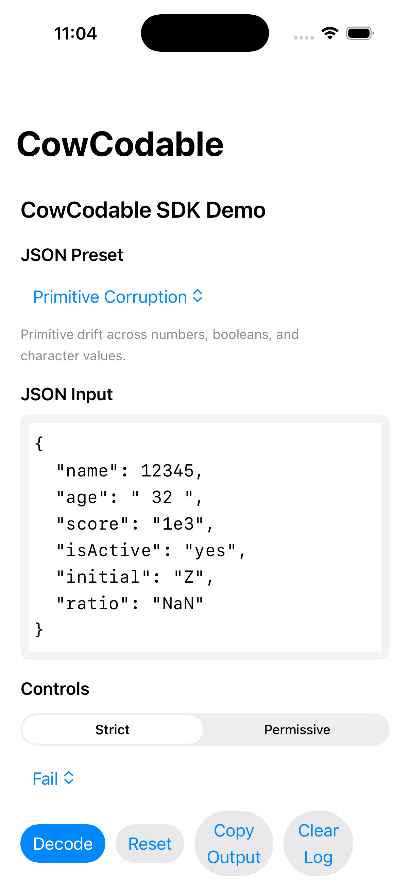
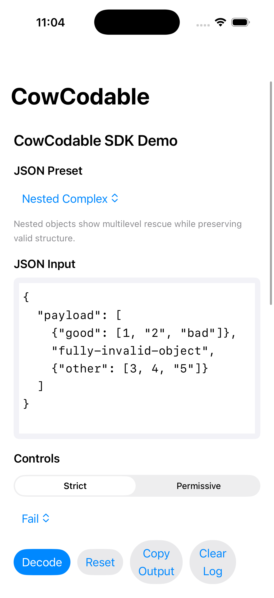
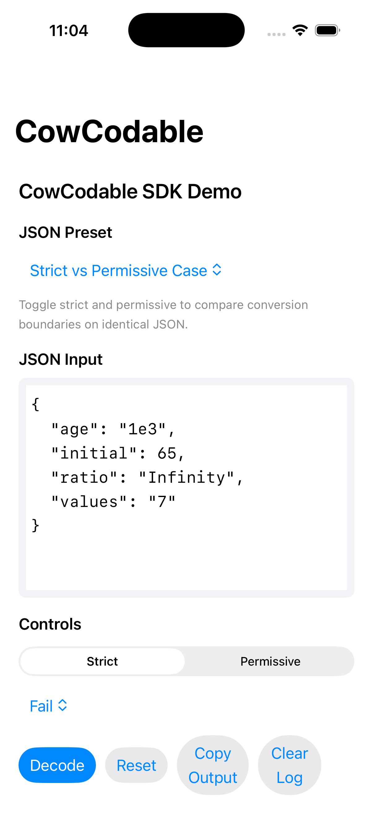
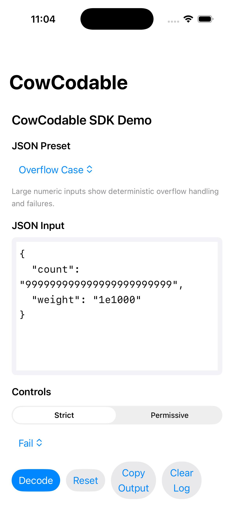

# CowCodable

CowCodable provides deterministic, production-safe JSON resilience for Swift models using a single wrapper:

```swift
@CowResilient var value: Int = 0
```

## What It Solves

Real backend payloads frequently drift:
- Type mismatches (`"42"` instead of `42`)
- Partially corrupted arrays/dictionaries
- Missing keys vs explicit `null`

CowCodable handles these cases explicitly while avoiding silent corruption.

## Design Principles

- Deterministic rescue
- No silent corruption
- No unsafe coercion
- Strong type safety
- Configurable null strategy

## Supported Types

`CowResilient<Value>` supports deterministic rescue for:
- `String`, `Int`, `Double`, `Float`, `Bool`, `Character`
- Arrays of supported primitive types
- Nested arrays of supported primitive types
- `[String: SupportedPrimitive]`
- Nested dictionaries of supported primitive values

## Conversion Rules Summary

| From JSON | To Swift | Strict | Permissive |
|----------|----------|--------|------------|
| `Int` | `String` | Yes | Yes |
| `Double` | `String` | Yes | Yes |
| `Bool` | `String` | Yes | Yes |
| Numeric `String` | `Int` | Yes (`"42"`) | Yes (`"42"`, `"1e3"` when integral) |
| `Double` | `Int` | Yes (integral only) | Yes (integral only) |
| Numeric `String` | `Double` | Yes | Yes |
| Numeric `String` | `Float` | Yes | Yes (`NaN`/`Infinity` allowed) |
| Bool-like `String` | `Bool` | Yes | Yes |
| Single-character `String` | `Character` | Yes | Yes |
| Integer Unicode scalar | `Character` | No | Yes |
| Scalar | `[T]` | No | Yes (single wrapped element) |

Ambiguous coercions always fail (`12.3 -> Int`, overflowed numeric conversions).

## Strict vs Permissive Modes

```swift
CowConfiguration.defaultRescueStrategy = StrictRescueStrategy.self
CowConfiguration.defaultRescueStrategy = PermissiveRescueStrategy.self
```

- `StrictRescueStrategy`: minimal deterministic coercion.
- `PermissiveRescueStrategy`: broader deterministic coercion for known backend drift.

## CowNullStrategy

```swift
CowConfiguration.defaultNullStrategy = .fail
CowConfiguration.defaultNullStrategy = .useDefault
CowConfiguration.defaultNullStrategy = .skip
```

`CowResilient` explicitly distinguishes:
- Missing key
- Explicit `null`
- Invalid type

## Deterministic Logging

CowCodable emits structured logs through `CowLogger`:
- rescued values
- skipped entries
- failures

Logs include coding paths and raw values for diagnostics and UI presentation.

## Repository Layout

```text
CowCodable/
├── Package.swift
├── README.md
├── Sources/CowCodable/
│   ├── Core/
│   ├── Bridge/
│   ├── Defaults/
│   ├── Logging/
│   └── Extensions/
├── Tests/CowCodableTests/
├── Examples/
├── docs/screenshots/
└── DemoApp/CowCodableDemoApp/
    ├── CowCodableDemoApp.xcodeproj
    └── CowCodableDemoApp/
```


## Requirements

- Swift 5.9+
- iOS 16.0+
- macOS 13.0+
- Xcode 15+

CowCodable uses modern Swift concurrency and type-safe rescue strategies.

## Installation

### Swift Package Manager

#### Using Xcode

1. Open your project in Xcode.
2. Go to **File → Add Package Dependencies…**
3. Enter the repository URL: https://github.com/ANSCoder/CowCodable.git
4. Select the latest version.
5. Add the **CowCodable** library to your target.

#### Using `Package.swift`

Add CowCodable to your dependencies:

```swift
dependencies: [
    .package(url: "https://github.com/ANSCoder/CowCodable.git", from: "1.0.0")
]
```

## Demo App

The repository includes a separate iOS SwiftUI demo app target:
- Project: `DemoApp/CowCodableDemoApp/CowCodableDemoApp.xcodeproj`
- Minimum iOS: `16.0`
- Interface: SwiftUI (no storyboard)

### Open and Run in Simulator

1. Open `DemoApp/CowCodableDemoApp/CowCodableDemoApp.xcodeproj` in Xcode.
2. Select the `CowCodableDemoApp` scheme.
3. Choose an iOS 16+ simulator device.
4. Build and run.

The app imports `CowCodable` as a local Swift package dependency from this repository root and does not duplicate SDK sources.

### Presets and What They Demonstrate

- `Primitive Corruption`: primitive type drift and deterministic rescue.
- `Array Corruption`: mixed arrays with rescued and skipped elements.
- `Dictionary Corruption`: value rescue and deterministic invalid entry dropping.
- `Nested Complex`: nested resilience across multiple levels.
- `Null Edge Case`: null/missing behavior under different null strategies.
- `Overflow Case`: deterministic overflow and non-finite numeric handling.
- `Strict vs Permissive Case`: side-by-side behavior change with identical input.

### Strict vs Permissive in the Demo

- `Strict` applies minimal deterministic coercion.
- `Permissive` allows additional deterministic conversions (for example scientific notation-to-int when integral, scalar-to-array wrapping, Unicode scalar character conversion).

Switching the segmented control changes only the configured rescue policy; input JSON stays unchanged so behavior differences are observable.

## Screenshots

### Main View


### Strict Mode


### Permissive Mode


### Overflow Case


## Example Model

```swift
struct Profile: Codable {
    @CowResilient var id: String = ""
    @CowResilient var score: Double = 0
    @CowResilient var flags: [Bool] = []
}
```

## Performance Characteristics

- O(1) direct primitive rescue
- O(n) array/dictionary rescue
- No reflection or runtime type hacks

## Thread Safety

- `CowResilient` is value-based and `Sendable` when `Value` is `Sendable`.
- `CowConfiguration` and `CowLogger` are lock-protected.
- Decode on background queues and update UI on main thread.

## Limitations

- No rescue for arbitrary `Codable` object graphs via reflection
- No ambiguous coercion
- No hidden mutation of invalid backend data
- No magic auto-fixes outside documented conversion rules

## Quality Gates

The repository uses deterministic validation for both SDK and demo app:

1. `swift build`
2. `swift test`
3. `xcodebuild -project DemoApp/CowCodableDemoApp/CowCodableDemoApp.xcodeproj -scheme CowCodableDemoApp -destination 'generic/platform=iOS Simulator' CODE_SIGNING_ALLOWED=NO build`

These checks run in CI at `.github/workflows/ci.yml`.

## Code Style

This project enforces consistent formatting via:

- `.editorconfig` (editor-level policy)
- `.swiftformat` (SwiftFormat configuration)

Formatting is validated in CI.

## License

CowCodable is released under the MIT License.

See the LICENSE file for details.
